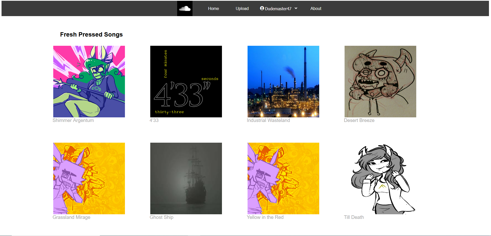

## Documentation

## Link to Live Site
CURRENTLY NOT HOSTED

## Link to the Github Repo
How are you reading this if you're not already there?
https://github.com/Dudemaster47/API-project/tree/master

## Intro

"Soundcloun" is a music hosting and playing website for sharing music with friends and other random strangers who happen to find it. As of the 0.0.1 build, it kind of works! Users can upload music (provided it has already been uploaded elsewhere on the internet), and listen to it as well! Downloading music is still in progress, as is hosting it. This website takes a great deal of inspiration and its entire aesthetic from SoundCloud, and its name is derived from it. SoundCloud -> SoundClone -> Sound Clou...ne. SoundCloun.

## Technologies Used
Listed here are the various bits and bobs of tech used to create Soundcloun:

- Visual Studio Code
- HTML
- CSS
- React 
- Redux
- Node.js
- Express
- Sequelize
- Heroku (but after the end of this month of November 2022, not Heroku)
- Sqlite
- AWS
- Font Awesome
- Ionicons 4
- Favicon

## Database Schema

## Sample Image

## How to Launch Locally

1. Clone/Download this project repository to your machine
2. Extract the directory, and have two terminal windows ready (for Windows, make sure you're using WSL).
3. Open up the backend folder in one terminal and type 'npm start' to get the backend server running.
4. Open up the frontend folder in the other terminal and type 'npm start' to get the frontend server running.
5. That's kind of it really. 

## To-Do

1. Implement Albums
2. Implement Playlists
3. Honestly? Overhaul what I've already got. This whole thing is spaghetti code central.
4. Implement more social media functions such as liking and sharing music.
5. Style the Nav Bar better so it actually has interactivity and shows which page you're on. 
6. Prettier and more interactive styling in general.
7. Style things so they're not only functional and decent-looking on my desktop specifically.
8. Really, just prettier styling in general.
9. Implement tracking of how many times a song has been played as well as how many independent users have listened to it.
10. Put user profile pictures next to comments (this should honestly be higher up on the list).
11. For that matter, user profile options so they can actually change and assign their profile pictures. 
12. Volume bar on the audio player (this should honestly be higher up on the list).
13. Make the back and forward buttons on the audio player go back and forth between songs in a playlist or album (this should honestly be higher up on the list).
14. Make a secondary audio player that persists between pages and continues playing whatever song it's currently on (repeat after me: this should honestly be higher up on the list).

## Technical Implementation Details

Imma be real, the biggest challenges I faced involved literally everything involving redux. Turns out, I don't really get redux yet and it showed with my clumsy handling of state repeatedly over the course of the project.

I can't really point to good, specific examples because most of my issues were ultimately stemming from my overall lack of comprehension of and experience with redux as a whole, as well as me making stupid typos that were very quickly fixed once recognized. Ultimately the whole dang front end is an example of the things I found challenging, so, y'know. Pick through that and copy any bit of code and you'll probably have found something I struggled with.
